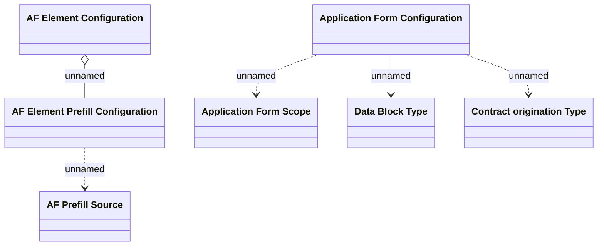

# AF configuration

- **Diagram Type**: Logical
- **Package**: HomerSelect/BSL/Analysis Model/Contract Origination/Fill in application/COMMON for Fill in application/Logical Data Model/AF configuration
- **Diagram ID**: 150061
- **Elements**: 8
- **Connectors**: 5

