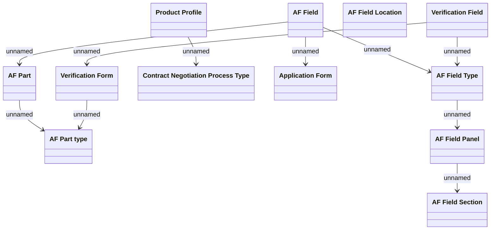

# AF structure

```mermaid
classDiagram
    class Verification_Field["Verification Field"]
    class Verification_Form["Verification Form"]
    class AF_Field_Type["AF Field Type"]
    class AF_Part_type["AF Part type"]
    class Product_Profile["Product Profile"]
    class Contract_Negotiation_Process_Type["Contract Negotiation Process Type"]
    class Application_Form["Application Form"]
    class AF_Field_Location["AF Field Location"]
    class AF_Field_Panel["AF Field Panel"]
    class AF_Part["AF Part"]
    class AF_Field_Section["AF Field Section"]
    class AF_Field["AF Field"]
    AF_Field --> AF_Field_Type : unnamed
    AF_Field --> AF_Part : unnamed
    AF_Field --> Application_Form : unnamed
    AF_Part --> AF_Part_type : unnamed
    AF_Field_Panel --> AF_Field_Section : unnamed
    AF_Field_Type --> AF_Field_Panel : unnamed
    Verification_Form --> AF_Part_type : unnamed
    Verification_Field --> Verification_Form : unnamed
    Verification_Field --> AF_Field_Type : unnamed
    Product_Profile --> Contract_Negotiation_Process_Type : unnamed
```
