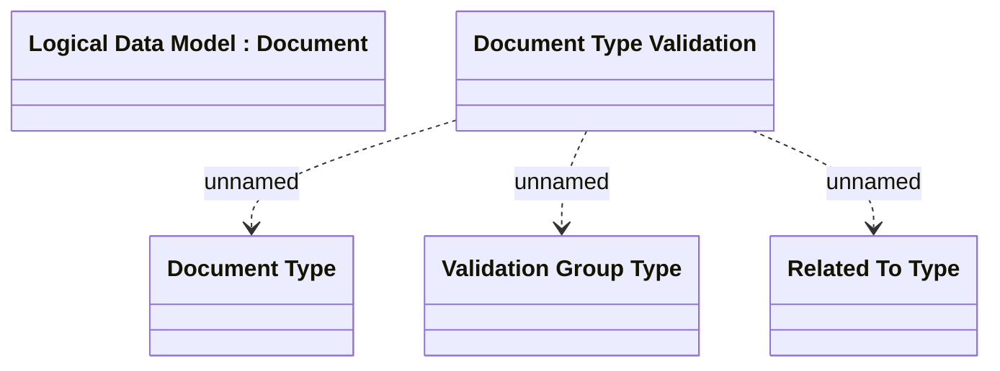

# Document Type Validation

- **Diagram Type**: Logical
- **Package**: HomerSelect/BSL/Analysis Model/Contract Origination/Fill in application/COMMON for Fill in application/Logical Data Model/Document Type Validation
- **Diagram ID**: 129436
- **Elements**: 5
- **Connectors**: 3

