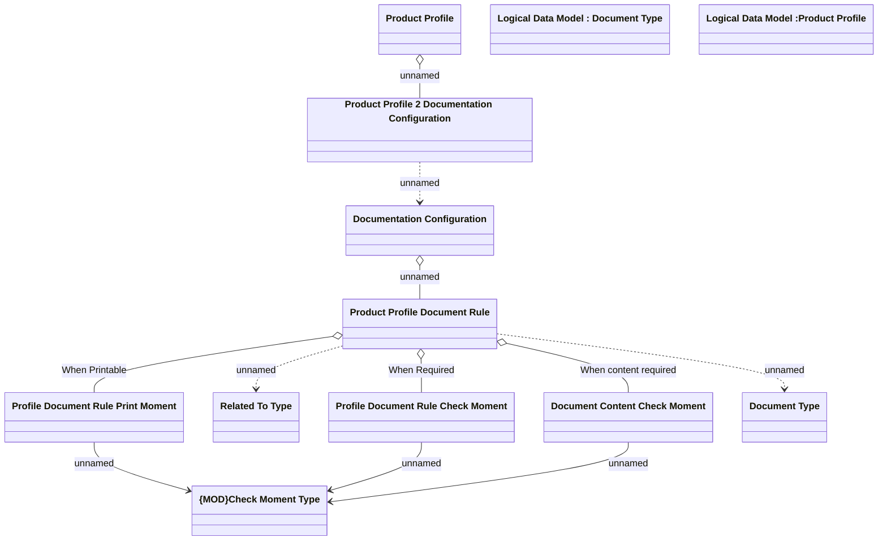

# Documentation Configuration

- **Diagram Type**: Logical
- **Package**: HomerSelect/BSL/Analysis Model/Contract Origination/Fill in application/COMMON for Fill in application/Logical Data Model/Documentation Configuration
- **Diagram ID**: 124151
- **Elements**: 12
- **Connectors**: 11

