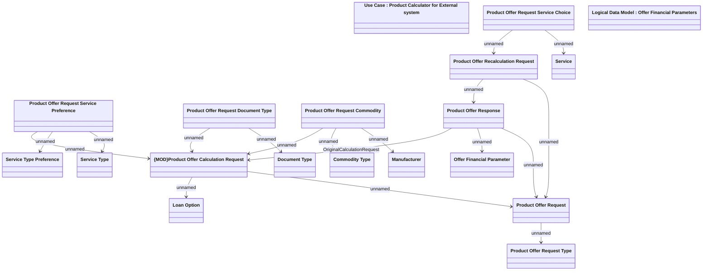

# Product Offers generated for External system

```mermaid
classDiagram
    class Manufacturer["Manufacturer"]
    class Use_Case_Product_Calculator_for_External_system["Use Case : Product Calculator for External system"]
    class Product_Offer_Request_Type["Product Offer Request Type"]
    class Service["Service"]
    class Product_Offer_Request_Service_Choice["Product Offer Request Service Choice"]
    class Product_Offer_Recalculation_Request["Product Offer Recalculation Request"]
    class Product_Offer_Request["Product Offer Request"]
    class Product_Offer_Request_Service_Preference["Product Offer Request Service Preference"]
    class Service_Type["Service Type"]
    class Service_Type_Preference["Service Type Preference"]
    class Loan_Option["Loan Option"]
    class Document_Type["Document Type"]
    class Product_Offer_Request_Document_Type["Product Offer Request Document Type"]
    class Commodity_Type["Commodity Type"]
    class Product_Offer_Request_Commodity["Product Offer Request Commodity"]
    class Logical_Data_Model_Offer_Financial_Parameters["Logical Data Model : Offer Financial Parameters"]
    class Product_Offer_Response["Product Offer Response"]
    class MOD_Product_Offer_Calculation_Request["{MOD}Product Offer Calculation Request"]
    class Offer_Financial_Parameter["Offer Financial Parameter"]
    Product_Offer_Request --> Product_Offer_Request_Type : unnamed
    Product_Offer_Request_Service_Choice --> Service : unnamed
    Product_Offer_Request_Service_Choice --> Product_Offer_Recalculation_Request : unnamed
    Product_Offer_Recalculation_Request --> Product_Offer_Request : unnamed
    MOD_Product_Offer_Calculation_Request --> Product_Offer_Request : unnamed
    Product_Offer_Response --> Product_Offer_Request : unnamed
    Product_Offer_Request_Service_Preference --> Service_Type : unnamed
    Product_Offer_Request_Commodity --> Manufacturer : unnamed
    Product_Offer_Request_Service_Preference --> Service_Type_Preference : unnamed
    Product_Offer_Response --> Offer_Financial_Parameter : unnamed
    MOD_Product_Offer_Calculation_Request --> Loan_Option : unnamed
    Product_Offer_Request_Document_Type --> Document_Type : unnamed
    Product_Offer_Request_Commodity --> Commodity_Type : unnamed
    Product_Offer_Recalculation_Request --> Product_Offer_Response : unnamed
    Product_Offer_Request_Commodity --> MOD_Product_Offer_Calculation_Request : unnamed
    Product_Offer_Request_Document_Type --> MOD_Product_Offer_Calculation_Request : unnamed
    Product_Offer_Request_Service_Preference --> MOD_Product_Offer_Calculation_Request : unnamed
    Product_Offer_Response --> MOD_Product_Offer_Calculation_Request : OriginalCalculationRequest
```
