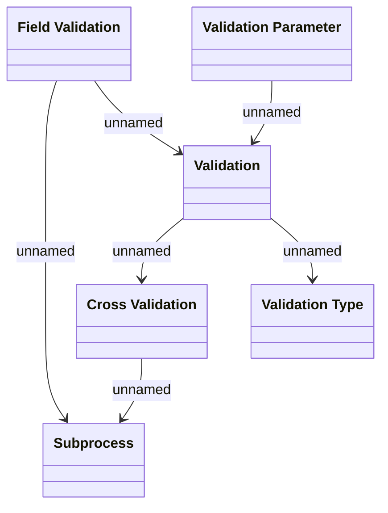

# Form Validations

```mermaid
classDiagram
    class Field_Validation["Field Validation"]
    class Validation_Parameter["Validation Parameter"]
    class Validation_Type["Validation Type"]
    class Validation["Validation"]
    class Cross_Validation["Cross Validation"]
    class Subprocess["Subprocess"]
    Field_Validation --> Subprocess : unnamed
    Cross_Validation --> Subprocess : unnamed
    Validation --> Cross_Validation : unnamed
    Field_Validation --> Validation : unnamed
    Validation_Parameter --> Validation : unnamed
    Validation --> Validation_Type : unnamed
```
