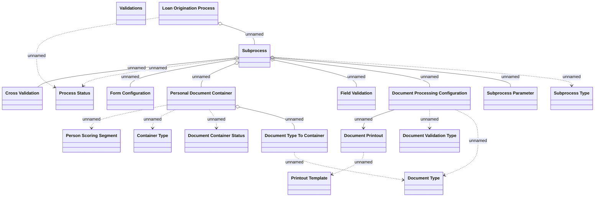

# Loan Origination Configuration

- **Diagram Type**: Logical
- **Package**: HomerSelect/BSL/Analysis Model/Contract Origination/Loan origination configuration /Logical Data Model
- **Diagram ID**: 129057
- **Elements**: 19
- **Connectors**: 19

