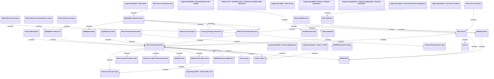

# Offer Financial Parameters

```mermaid
classDiagram
    class ADD_Offer_Discount_Item["{ADD} Offer Discount Item"]
    class StructuredParameter["StructuredParameter"]
    class Logical_Data_Model_Subventions["Logical Data Model : Subventions"]
    class Financing_Package_Subvention["Financing Package Subvention"]
    class Subvention_Participant["Subvention Participant"]
    class Qualification_Criteria["Qualification Criteria"]
    class Offer_prefererences_Qualification_criteria["Offer prefererences Qualification criteria"]
    class Offer_Service_Subvention_Item["Offer Service Subvention Item"]
    class Logical_Data_Model_Presented_interest_rate_Setting["Logical Data Model : Presented interest rate - Setting"]
    class MOD_Presented_IR_Setting["{MOD}Presented IR Setting"]
    class Interface_LAP_LAP_Offer_vector_attributes_for_Optional_offer["Interface LAP : LAP Offer vector - attributes for Optional offer Generation"]
    class Offer_Preferences_Product["Offer Preferences Product"]
    class MOD_Contract["{MOD}Contract"]
    class Offer_Presented_Interest_Rate["Offer Presented Interest Rate"]
    class Logical_Data_Model_Product_Management["Logical Data Model : Product Management"]
    class Installment_Part_Type["Installment Part Type"]
    class Logical_Data_Model_Offer_Service["Logical Data Model : Offer Service"]
    class Scoring_Type["Scoring Type"]
    class Offer_Financial_Parameter_Type["Offer Financial Parameter Type"]
    class Product_Transaction_Type["Product Transaction Type"]
    class Logical_Data_Model_Contract_Financial_parameters["Logical Data Model :Contract - Financial parameters"]
    class Temporary_Application_Temporary_Application_Financial_Parame["Temporary Application : Temporary Application - Financial Parameters"]
    class MOD_Temporary_Application["{MOD}Temporary Application"]
    class Logical_Data_Model_Product_Offer_Limit["Logical Data Model : Product Offer Limit"]
    class Structure_of_Offer_Financial_parametrs["Structure of Offer Financial parametrs"]
    class MOD_Tariff["{MOD}Tariff"]
    class MOD_Offer_Preferences["{MOD}Offer Preferences"]
    class MOD_Product_Offer_Limit["{MOD}Product Offer Limit"]
    class Logical_Data_Model_Tariff_and_Tariff_Item_Management["Logical Data Model : Tariff and Tariff Item Management"]
    class Logical_Data_Model_Loan_Service_Setting["Logical Data Model : Loan Service Setting"]
    class Logical_Data_Model_Product_Profile["Logical Data Model : Product - Profile"]
    class Offer_Service_Tariff_Item["Offer Service Tariff Item"]
    class Service["Service"]
    class Offer_Service["Offer Service"]
    class Offer_Tariff_Item["Offer Tariff Item"]
    class MOD_Offer_Subvention_Item["{MOD}Offer Subvention Item"]
    class MOD_Subvention["{MOD}Subvention"]
    class Financial_Parameter_Item_Type["Financial Parameter Item Type"]
    class Offer_Financial_Parameter_Item["Offer Financial Parameter Item"]
    class Offer_Financial_Parameter["Offer Financial Parameter"]
    class MOD_Tariff_Item["{MOD}Tariff Item"]
    class Offer_Installment_Part["Offer Installment Part"]
    class Offer_Installment["Offer Installment"]
    class Product_Variant["Product Variant"]
    MOD_Offer_Preferences --> Offer_Financial_Parameter : unnamed
    Offer_Tariff_Item --> Offer_Financial_Parameter_Item : unnamed
    Offer_Tariff_Item --> MOD_Tariff_Item : unnamed
    Offer_Service --> Offer_Financial_Parameter : unnamed
    Offer_Service --> Service : unnamed
    Offer_Service --> MOD_Tariff : unnamed
    Offer_Service_Tariff_Item --> Offer_Tariff_Item : unnamed
    Offer_Service_Tariff_Item --> Offer_Service : unnamed
    Logical_Data_Model_Product_Profile --> Product_Variant : unnamed
    ADD_Offer_Discount_Item --> Offer_Financial_Parameter_Item : unnamed
    MOD_Product_Offer_Limit --> Logical_Data_Model_Product_Offer_Limit : unnamed
    MOD_Offer_Subvention_Item --> MOD_Subvention : unnamed
    Logical_Data_Model_Product_Management --> Product_Variant : unnamed
    Offer_Presented_Interest_Rate --> Offer_Financial_Parameter : unnamed
    Offer_Presented_Interest_Rate --> MOD_Presented_IR_Setting : unnamed
    Offer_Preferences_Product --> MOD_Offer_Preferences : unnamed
    Offer_Service_Subvention_Item --> MOD_Offer_Subvention_Item : unnamed
    Offer_Service_Subvention_Item --> Offer_Service : unnamed
    Offer_prefererences_Qualification_criteria --> MOD_Offer_Preferences : unnamed
    Qualification_Criteria --> Offer_Financial_Parameter : unnamed
    StructuredParameter --> Offer_Financial_Parameter : unnamed
    MOD_Product_Offer_Limit --> Product_Transaction_Type : unnamed
    Offer_Financial_Parameter --> Product_Transaction_Type : unnamed
    Offer_Installment --> Offer_Financial_Parameter : unnamed
    Offer_Installment_Part --> Installment_Part_Type : unnamed
    Offer_Installment_Part --> Offer_Installment : unnamed
    Offer_Installment_Part --> MOD_Tariff_Item : unnamed
    MOD_Tariff_Item --> MOD_Tariff : unnamed
    Offer_Financial_Parameter --> Offer_Financial_Parameter_Type : unnamed
    Offer_Financial_Parameter --> Structure_of_Offer_Financial_parametrs : unnamed
    Offer_Financial_Parameter --> MOD_Contract : unnamed
    Offer_Financial_Parameter --> MOD_Product_Offer_Limit : unnamed
    Offer_Financial_Parameter --> MOD_Product_Offer_Limit : unnamed
    MOD_Offer_Subvention_Item --> Subvention_Participant : unnamed
    Offer_Financial_Parameter --> MOD_Tariff : unnamed
    MOD_Offer_Subvention_Item --> Financing_Package_Subvention : {PCG-1844}
    Offer_Financial_Parameter --> MOD_Temporary_Application : unnamed
    Offer_Financial_Parameter --> Product_Variant : based on
    Offer_Financial_Parameter_Item --> Offer_Financial_Parameter : unnamed
    Offer_Financial_Parameter_Item --> Financial_Parameter_Item_Type : unnamed
    MOD_Offer_Subvention_Item --> Offer_Financial_Parameter_Item : unnamed
    Offer_Financial_Parameter --> Scoring_Type : unnamed
```
