# Offer Service

- **Diagram Type**: Logical
- **Package**: HomerSelect/BSL/Analysis Model/Contract Origination/Manage Product Offer/Logical Data Model
- **Diagram ID**: 164358
- **Elements**: 31
- **Connectors**: 26

```mermaid
classDiagram
    class Offer_service_custom_data["Offer service custom data"]
    class Logical_Data_Model_Product_Offers_generated_for_External_sys["Logical Data Model : Product Offers generated for External system"]
    class Product_Offer_Request_Commodity["Product Offer Request Commodity"]
    class Offer_Insurance_Custom_Data["Offer Insurance Custom Data"]
    class Insurance_Custom_Data_Def["Insurance Custom Data Def"]
    class Statement_Channel["Statement Channel"]
    class Logical_Data_Model_REL_Installment_Plan_service_parameters["Logical Data Model : REL Installment Plan service - parameters"]
    class Offer_RELIP_Service_Variant_Installment["Offer RELIP Service Variant Installment"]
    class Offer_RELIP_Service_Variant["Offer RELIP Service Variant"]
    class RELIP_Service_Variant["RELIP Service Variant"]
    class RELIP_Service["RELIP Service"]
    class RELIP_Service_Variant_Term["RELIP Service Variant Term"]
    class Offer_RELIP_Service["Offer RELIP Service"]
    class Logical_Data_Model_Offer_Financial_Parameters["Logical Data Model : Offer Financial Parameters"]
    class Logical_Data_Model_Contract_Financial_parameters["Logical Data Model :Contract - Financial parameters"]
    class Offer_Card_Service["Offer Card Service"]
    class Logical_Data_Model_Insurance_Contract["Logical Data Model : Insurance Contract"]
    class Insurance_Program["Insurance Program"]
    class Insurance_Contract["Insurance Contract"]
    class Offer_Insurance_Service["Offer Insurance Service"]
    class Contract_Service_Parameter_Type["Contract Service Parameter Type"]
    class Offer_Service_Parameter["Offer Service Parameter"]
    class MOD_Contract["{MOD}Contract"]
    class Temporary_Application_Temporary_Application_Financial_Parame["Temporary Application : Temporary Application - Financial Parameters"]
    class MOD_Temporary_Application["{MOD}Temporary Application"]
    class MOD_Tariff["{MOD}Tariff"]
    class Logical_Data_Model_Tariff_and_Tariff_Item_Management["Logical Data Model : Tariff and Tariff Item Management"]
    class Logical_Data_Model_Loan_Service_Setting["Logical Data Model : Loan Service Setting"]
    class Service["Service"]
    class Offer_Service["Offer Service"]
    class Offer_Financial_Parameter["Offer Financial Parameter"]
    Offer_Service <|-- Offer_Insurance_Service : unnamed
    Offer_Insurance_Custom_Data ..> Insurance_Custom_Data_Def : unnamed
    Offer_Insurance_Service o-- Offer_Insurance_Custom_Data : unnamed
    Insurance_Program o-- Insurance_Custom_Data_Def : unnamed
    Offer_RELIP_Service_Variant o-- Offer_RELIP_Service_Variant_Installment : unnamed
    Offer_RELIP_Service_Variant --> RELIP_Service_Variant_Term : unnamed
    Offer_RELIP_Service o-- Offer_RELIP_Service_Variant : unnamed
    RELIP_Service o-- RELIP_Service_Variant : unnamed
    RELIP_Service_Variant o-- RELIP_Service_Variant_Term : unnamed
    Offer_Service <|-- Offer_RELIP_Service : unnamed
    Offer_Card_Service ..> Statement_Channel : unnamed
    Offer_Service <|-- Offer_Card_Service : unnamed
    Offer_Service o-- Offer_service_custom_data : unnamed
    Offer_Insurance_Service ..> Insurance_Contract : unnamed
    Offer_Financial_Parameter --> MOD_Contract : unnamed
    Offer_Insurance_Service ..> Insurance_Program : unnamed
    Offer_Service o-- Offer_Service_Parameter : unnamed
    Offer_Service_Parameter ..> Contract_Service_Parameter_Type : unnamed
    Offer_Service --> MOD_Tariff : unnamed
    Offer_Service --> Service : unnamed
    Offer_Service --> Product_Offer_Request_Commodity : unnamed
    Offer_Financial_Parameter o-- Offer_Service : unnamed
    Offer_Financial_Parameter ..> MOD_Tariff : unnamed
    Offer_Financial_Parameter --> MOD_Temporary_Application : unnamed
    Offer_Financial_Parameter --> MOD_Tariff : unnamed
    Insurance_Contract ..> Insurance_Program : unnamed
```

