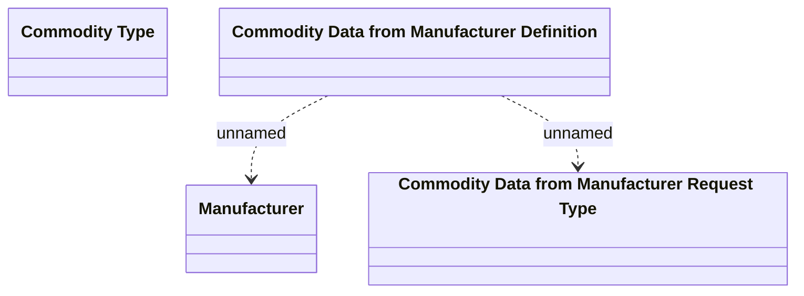

# Commodity Data from Manufacturer

- **Diagram Type**: Logical
- **Package**: HomerSelect/BSL/Analysis Model/Contract Origination/Manage Product Offer/Logical Data Model/Commodity Data From Manufacturer
- **Diagram ID**: 79800
- **Elements**: 4
- **Connectors**: 2

