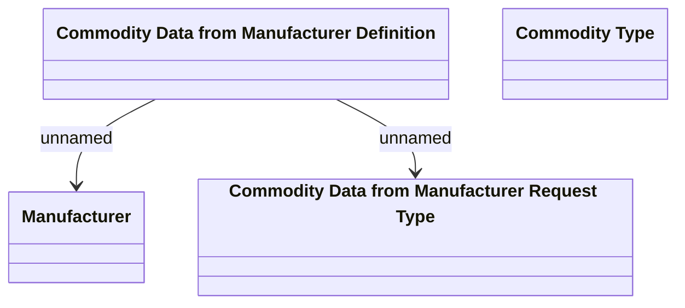

# Commodity Data from Manufacturer

```mermaid
classDiagram
    class Commodity_Data_from_Manufacturer_Request_Type["Commodity Data from Manufacturer Request Type"]
    class Manufacturer["Manufacturer"]
    class Commodity_Data_from_Manufacturer_Definition["Commodity Data from Manufacturer Definition"]
    class Commodity_Type["Commodity Type"]
    Commodity_Data_from_Manufacturer_Definition --> Manufacturer : unnamed
    Commodity_Data_from_Manufacturer_Definition --> Commodity_Data_from_Manufacturer_Request_Type : unnamed
```
