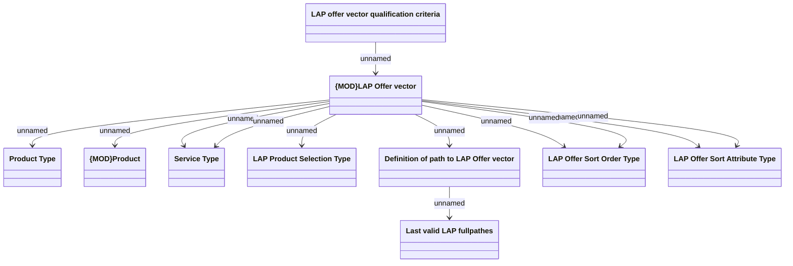

# LAP Offer vector - attributes for Optional offer Generation

```mermaid
classDiagram
    class LAP_offer_vector_qualification_criteria["LAP offer vector qualification criteria"]
    class Last_valid_LAP_fullpathes["Last valid LAP fullpathes"]
    class Product_Type["Product Type"]
    class MOD_Product["{MOD}Product"]
    class Service_Type["Service Type"]
    class LAP_Product_Selection_Type["LAP Product Selection Type"]
    class Definition_of_path_to_LAP_Offer_vector["Definition of path to LAP Offer vector"]
    class LAP_Offer_Sort_Order_Type["LAP Offer Sort Order Type"]
    class LAP_Offer_Sort_Attribute_Type["LAP Offer Sort Attribute Type"]
    class MOD_LAP_Offer_vector["{MOD}LAP Offer vector"]
    LAP_offer_vector_qualification_criteria --> MOD_LAP_Offer_vector : unnamed
    MOD_LAP_Offer_vector --> LAP_Offer_Sort_Attribute_Type : unnamed
    MOD_LAP_Offer_vector --> LAP_Offer_Sort_Attribute_Type : unnamed
    MOD_LAP_Offer_vector --> LAP_Offer_Sort_Order_Type : unnamed
    MOD_LAP_Offer_vector --> LAP_Offer_Sort_Order_Type : unnamed
    MOD_LAP_Offer_vector --> Definition_of_path_to_LAP_Offer_vector : unnamed
    MOD_LAP_Offer_vector --> LAP_Product_Selection_Type : unnamed
    MOD_LAP_Offer_vector --> Service_Type : unnamed
    MOD_LAP_Offer_vector --> Service_Type : unnamed
    MOD_LAP_Offer_vector --> MOD_Product : unnamed
    MOD_LAP_Offer_vector --> Product_Type : unnamed
    Definition_of_path_to_LAP_Offer_vector --> Last_valid_LAP_fullpathes : unnamed
```
