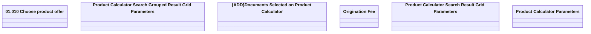

# Product Calculator Parametrization

- **Diagram Type**: Logical
- **Package**: HomerSelect/BSL/Analysis Model/Contract Origination/Manage Product Offer/User Interface Model/Choose Product Offer/Customization
- **Diagram ID**: 147616
- **Elements**: 8
- **Connectors**: 0

