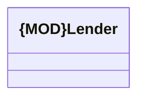

# Enumeration

- **Diagram Type**: Logical
- **Package**: HomerSelect/BSL/Analysis Model/Contract Origination/Party/Logical Data Model
- **Diagram ID**: 149802
- **Elements**: 1
- **Connectors**: 0

