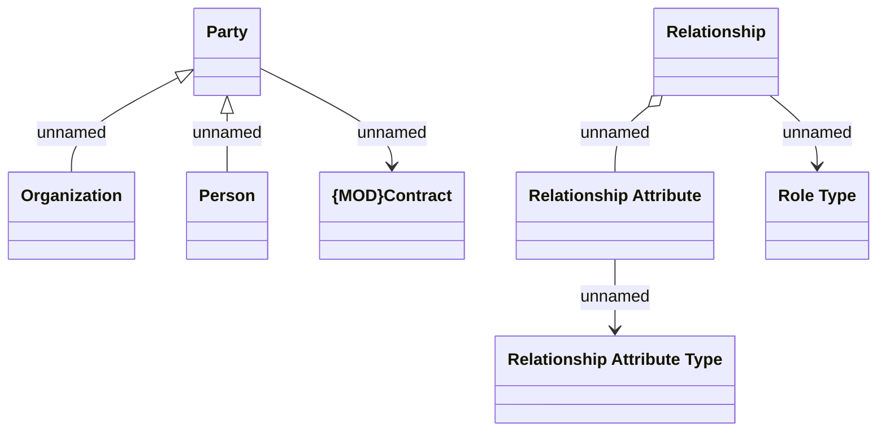

# Party

- **Diagram Type**: Logical
- **Package**: HomerSelect/BSL/Analysis Model/Contract Origination/Party/Logical Data Model
- **Diagram ID**: 149801
- **Elements**: 8
- **Connectors**: 6

```mermaid
classDiagram
    class Organization["Organization"]
    class Person["Person"]
    class Party["Party"]
    class Relationship_Attribute_Type["Relationship Attribute Type"]
    class Relationship["Relationship"]
    class MOD_Contract["{MOD}Contract"]
    class Relationship_Attribute["Relationship Attribute"]
    class Role_Type["Role Type"]
    Relationship o-- Relationship_Attribute : unnamed
    Relationship_Attribute --> Relationship_Attribute_Type : unnamed
    Relationship --> Role_Type : unnamed
    Party --> MOD_Contract : unnamed
    Party <|-- Person : unnamed
    Party <|-- Organization : unnamed
```
