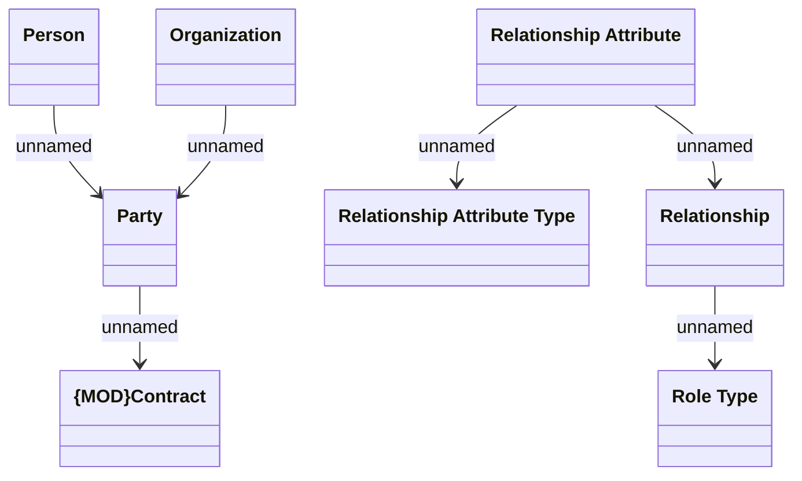

# Party

```mermaid
classDiagram
    class Organization["Organization"]
    class Person["Person"]
    class Party["Party"]
    class Relationship_Attribute_Type["Relationship Attribute Type"]
    class Relationship["Relationship"]
    class MOD_Contract["{MOD}Contract"]
    class Relationship_Attribute["Relationship Attribute"]
    class Role_Type["Role Type"]
    Relationship_Attribute --> Relationship : unnamed
    Relationship_Attribute --> Relationship_Attribute_Type : unnamed
    Relationship --> Role_Type : unnamed
    Party --> MOD_Contract : unnamed
    Person --> Party : unnamed
    Organization --> Party : unnamed
```
