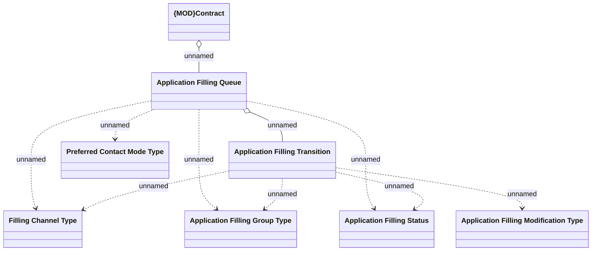

# Application Filling Queue

- **Diagram Type**: Logical
- **Package**: HomerSelect/BSL/Analysis Model/Contract Origination/Support for 2BoD Processing/Logical Data Model
- **Diagram ID**: 123548
- **Elements**: 8
- **Connectors**: 10

