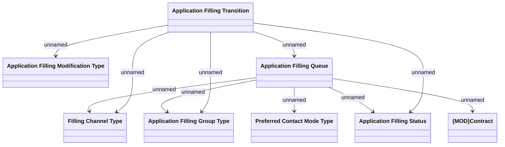

# Application Filling Queue

```mermaid
classDiagram
    class Filling_Channel_Type["Filling Channel Type"]
    class MOD_Contract["{MOD}Contract"]
    class Application_Filling_Modification_Type["Application Filling Modification Type"]
    class Application_Filling_Transition["Application Filling Transition"]
    class Application_Filling_Group_Type["Application Filling Group Type"]
    class Application_Filling_Status["Application Filling Status"]
    class Preferred_Contact_Mode_Type["Preferred Contact Mode Type"]
    class Application_Filling_Queue["Application Filling Queue"]
    Application_Filling_Queue --> Filling_Channel_Type : unnamed
    Application_Filling_Queue --> Application_Filling_Group_Type : unnamed
    Application_Filling_Queue --> Preferred_Contact_Mode_Type : unnamed
    Application_Filling_Queue --> Application_Filling_Status : unnamed
    Application_Filling_Transition --> Application_Filling_Queue : unnamed
    Application_Filling_Transition --> Filling_Channel_Type : unnamed
    Application_Filling_Transition --> Application_Filling_Status : unnamed
    Application_Filling_Transition --> Application_Filling_Group_Type : unnamed
    Application_Filling_Transition --> Application_Filling_Modification_Type : unnamed
    Application_Filling_Queue --> MOD_Contract : unnamed
```
