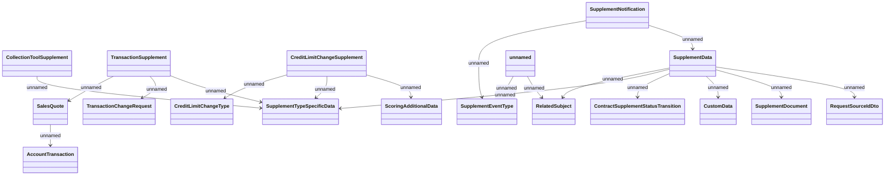

# Contract Supplement Notifications v3

```mermaid
classDiagram
    class ScoringAdditionalData["ScoringAdditionalData"]
    class CollectionToolSupplement["CollectionToolSupplement"]
    class TransactionChangeRequest["TransactionChangeRequest"]
    class SalesQuote["SalesQuote"]
    class RequestSourceIdDto["RequestSourceIdDto"]
    class AccountTransaction["AccountTransaction"]
    class SupplementDocument["SupplementDocument"]
    class CustomData["CustomData"]
    class RelatedSubject["RelatedSubject"]
    class SupplementTypeSpecificData["SupplementTypeSpecificData"]
    class TransactionSupplement["TransactionSupplement"]
    class CreditLimitChangeSupplement["CreditLimitChangeSupplement"]
    class SupplementData["SupplementData"]
    class SupplementEventType["SupplementEventType"]
    class SupplementNotification["SupplementNotification"]
    class CreditLimitChangeType["CreditLimitChangeType"]
    class ContractSupplementStatusTransition["ContractSupplementStatusTransition"]
    TransactionSupplement --> SupplementTypeSpecificData : unnamed
    TransactionSupplement --> TransactionChangeRequest : unnamed
    TransactionSupplement --> SalesQuote : unnamed
    SupplementData --> RequestSourceIdDto : unnamed
    SalesQuote --> AccountTransaction : unnamed
    SupplementData --> SupplementDocument : unnamed
    SupplementData --> CustomData : unnamed
    CreditLimitChangeSupplement --> ScoringAdditionalData : unnamed
    unnamed --> RelatedSubject : unnamed
    SupplementData --> ContractSupplementStatusTransition : unnamed
    CollectionToolSupplement --> SupplementTypeSpecificData : unnamed
    CreditLimitChangeSupplement --> SupplementTypeSpecificData : unnamed
    SupplementData --> SupplementTypeSpecificData : unnamed
    SupplementNotification --> SupplementData : unnamed
    unnamed --> SupplementEventType : unnamed
    SupplementNotification --> SupplementEventType : unnamed
    CreditLimitChangeSupplement --> CreditLimitChangeType : unnamed
    SupplementData --> RelatedSubject : unnamed
```
