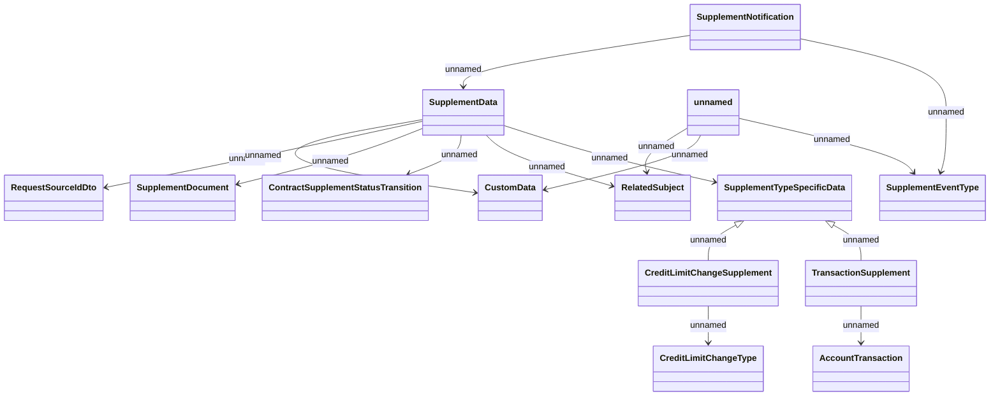

# Contract Supplement Notifications

- **Diagram Type**: Logical
- **Package**: HomerSelect/BSL/Analysis Model/Contract Supplements/COMMON for Supplements/Contract Supplement operations/Contract Supplement management/Interface Provided/Generated Notifications/Contract Supplement Notifications/Contract Supplement Notifications
- **Diagram ID**: 162751
- **Elements**: 16
- **Connectors**: 15

