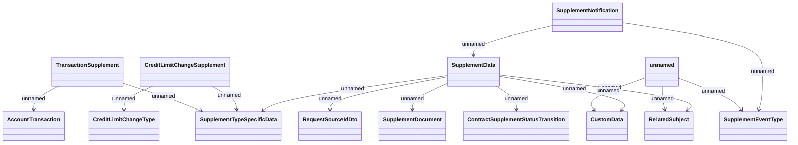

# Contract Supplement Notifications

```mermaid
classDiagram
    class RequestSourceIdDto["RequestSourceIdDto"]
    class AccountTransaction["AccountTransaction"]
    class SupplementDocument["SupplementDocument"]
    class CustomData["CustomData"]
    class RelatedSubject["RelatedSubject"]
    class SupplementTypeSpecificData["SupplementTypeSpecificData"]
    class TransactionSupplement["TransactionSupplement"]
    class CreditLimitChangeSupplement["CreditLimitChangeSupplement"]
    class SupplementData["SupplementData"]
    class SupplementEventType["SupplementEventType"]
    class SupplementNotification["SupplementNotification"]
    class CreditLimitChangeType["CreditLimitChangeType"]
    class ContractSupplementStatusTransition["ContractSupplementStatusTransition"]
    SupplementNotification --> SupplementData : unnamed
    SupplementNotification --> SupplementEventType : unnamed
    SupplementData --> CustomData : unnamed
    SupplementData --> RequestSourceIdDto : unnamed
    SupplementData --> SupplementDocument : unnamed
    SupplementData --> ContractSupplementStatusTransition : unnamed
    SupplementData --> RelatedSubject : unnamed
    SupplementData --> SupplementTypeSpecificData : unnamed
    CreditLimitChangeSupplement --> CreditLimitChangeType : unnamed
    CreditLimitChangeSupplement --> SupplementTypeSpecificData : unnamed
    TransactionSupplement --> SupplementTypeSpecificData : unnamed
    TransactionSupplement --> AccountTransaction : unnamed
    unnamed --> RelatedSubject : unnamed
    unnamed --> CustomData : unnamed
    unnamed --> SupplementEventType : unnamed
```
