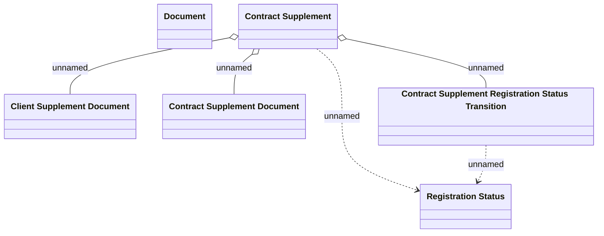

# Contract Supplement registration domain

- **Diagram Type**: Logical
- **Package**: HomerSelect/BSL/Analysis Model/Contract Supplements/COMMON for Supplements/Contract Supplement operations/Contract Supplement registration/Logical data model
- **Diagram ID**: 162868
- **Elements**: 6
- **Connectors**: 5

