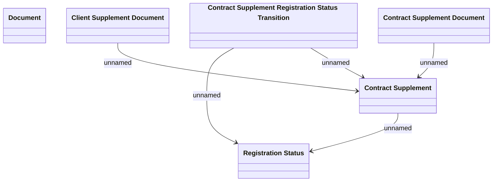

# Contract Supplement registration domain

```mermaid
classDiagram
    class Document["Document"]
    class Client_Supplement_Document["Client Supplement Document"]
    class Contract_Supplement_Document["Contract Supplement Document"]
    class Registration_Status["Registration Status"]
    class Contract_Supplement_Registration_Status_Transition["Contract Supplement Registration Status Transition"]
    class Contract_Supplement["Contract Supplement"]
    Contract_Supplement --> Registration_Status : unnamed
    Contract_Supplement_Registration_Status_Transition --> Registration_Status : unnamed
    Contract_Supplement_Registration_Status_Transition --> Contract_Supplement : unnamed
    Client_Supplement_Document --> Contract_Supplement : unnamed
    Contract_Supplement_Document --> Contract_Supplement : unnamed
```
