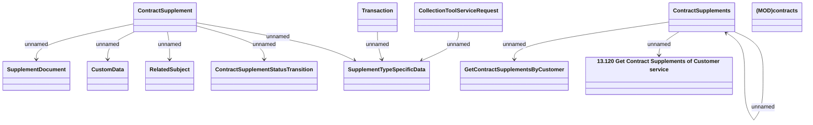

# Contract Supplements - Get Contract Supplement by CUID v3

```mermaid
classDiagram
    class SupplementDocument["SupplementDocument"]
    class CustomData["CustomData"]
    class RelatedSubject["RelatedSubject"]
    class CollectionToolServiceRequest["CollectionToolServiceRequest"]
    class ContractSupplementStatusTransition["ContractSupplementStatusTransition"]
    class SupplementTypeSpecificData["SupplementTypeSpecificData"]
    class Transaction["Transaction"]
    class ContractSupplements["ContractSupplements"]
    class ContractSupplement["ContractSupplement"]
    class MOD_contracts["(MOD)contracts"]
    class GetContractSupplementsByCustomer["GetContractSupplementsByCustomer"]
    class ContractSupplements["ContractSupplements"]
    class n_13_120_Get_Contract_Supplements_of_Customer_service["13.120 Get Contract Supplements of Customer service"]
    ContractSupplements --> n_13_120_Get_Contract_Supplements_of_Customer_service : unnamed
    ContractSupplements --> GetContractSupplementsByCustomer : unnamed
    ContractSupplements --> ContractSupplements : unnamed
    CollectionToolServiceRequest --> SupplementTypeSpecificData : unnamed
    Transaction --> SupplementTypeSpecificData : unnamed
    ContractSupplement --> SupplementTypeSpecificData : unnamed
    ContractSupplement --> ContractSupplementStatusTransition : unnamed
    ContractSupplement --> RelatedSubject : unnamed
    ContractSupplement --> CustomData : unnamed
    ContractSupplement --> SupplementDocument : unnamed
```
