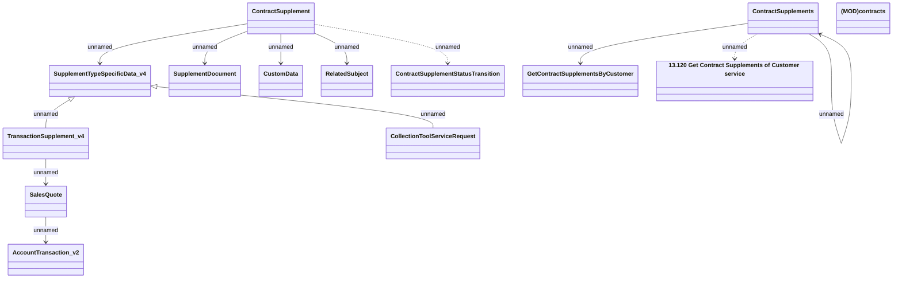

# Contract Supplements - Get Contract Supplement by CUID v4

- **Diagram Type**: Logical
- **Package**: HomerSelect/BSL/Analysis Model/Contract Supplements/COMMON for Supplements/Contract Supplement operations/Contract Supplement management/Interface Provided/Web Services/ContractSupplements
- **Diagram ID**: 164454
- **Elements**: 15
- **Connectors**: 12

