# Contract Supplements

- **Diagram Type**: Logical
- **Package**: HomerSelect/BSL/Analysis Model/Contract Supplements/COMMON for Supplements/Contract Supplement operations/Contract Supplement management/Logical Data Model
- **Diagram ID**: 162697
- **Elements**: 23
- **Connectors**: 25

```mermaid
classDiagram
    class Logical_Data_Model_Scoring["Logical Data Model : Scoring"]
    class Client_Supplement_Document["Client Supplement Document"]
    class Contract_Supplement_Status_Transitions_Reason["Contract Supplement Status Transitions Reason"]
    class Logical_data_model_Credit_limit_change_offer["Logical data model :Credit limit change offer"]
    class Credit_Limit_Change_Offer["Credit Limit Change Offer"]
    class Credit_Limit_Change_Source_Type["Credit Limit Change Source Type"]
    class Credit_Limit_Change_Contract_Supplement["Credit Limit Change Contract Supplement"]
    class Logical_Data_Model_Supplement_Definition["Logical Data Model : Supplement Definition"]
    class Scoring["Scoring"]
    class Salesman["Salesman"]
    class Salesroom["Salesroom"]
    class MOD_Client_Snapshot["{MOD}Client Snapshot"]
    class Contract_Supplement_Scoring["Contract Supplement Scoring"]
    class Contract_Supplement_Registration_Status_Transition["Contract Supplement Registration Status Transition"]
    class Contract_Supplement_Status_Type["Contract Supplement Status Type"]
    class Supplement["Supplement"]
    class Contract_Supplement_Custom_Data["Contract Supplement Custom Data"]
    class Contract_Service["Contract Service"]
    class Contract_Supplement_Document["Contract Supplement Document"]
    class Contract_Supplement_Status_Transition["Contract Supplement Status Transition"]
    class Document["Document"]
    class Contract_Supplement["Contract Supplement"]
    class MOD_Contract["{MOD}Contract"]
    Contract_Supplement --> Supplement : unnamed
    Contract_Supplement o-- Client_Supplement_Document : unnamed
    Contract_Supplement o-- Contract_Supplement_Registration_Status_Transition : unnamed
    Contract_Supplement o-- Contract_Supplement_Custom_Data : unnamed
    Contract_Supplement_Document ..> Document : unnamed
    Contract_Supplement o-- Contract_Supplement_Document : unnamed
    Contract_Supplement_Status_Transition ..> Contract_Supplement_Status_Type : unnamed
    Contract_Supplement o-- Contract_Supplement_Status_Transition : unnamed
    Contract_Supplement_Status_Transition ..> Contract_Supplement_Status_Transitions_Reason : unnamed
    Client_Supplement_Document ..> Document : unnamed
    Contract_Supplement --> Contract_Service : Contract Service Supplement
    Contract_Supplement o-- Contract_Supplement_Scoring : unnamed
    Contract_Supplement --> Salesman : Arranged with
    Contract_Supplement ..> Contract_Supplement_Status_Type : unnamed
    Contract_Supplement_Status_Transitions_Reason ..> Contract_Supplement_Status_Type : unnamed
    Credit_Limit_Change_Offer --> MOD_Contract : unnamed
    Credit_Limit_Change_Contract_Supplement --> Credit_Limit_Change_Offer : unnamed
    Credit_Limit_Change_Contract_Supplement ..> Credit_Limit_Change_Source_Type : unnamed
    Contract_Supplement <|-- Credit_Limit_Change_Contract_Supplement : unnamed
    Contract_Supplement_Scoring --> Scoring : unnamed
    Contract_Supplement --> Salesroom : Arranged on salesroom
    MOD_Contract --> MOD_Client_Snapshot : unnamed
    MOD_Contract o-- Contract_Service : unnamed
    MOD_Contract o-- Contract_Supplement : unnamed
    Supplement --> Logical_Data_Model_Supplement_Definition : unnamed
```

