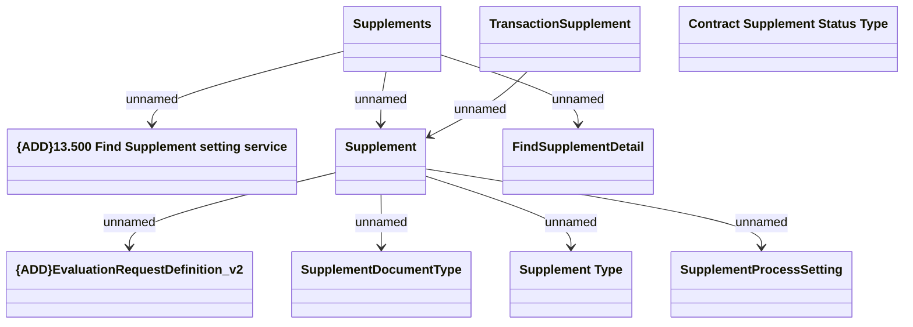

# Supplement definition - Get Supplement setting

```mermaid
classDiagram
    class ADD_EvaluationRequestDefinition_v2["{ADD}EvaluationRequestDefinition_v2"]
    class Supplement_Type["Supplement Type"]
    class TransactionSupplement["TransactionSupplement"]
    class SupplementDocumentType["SupplementDocumentType"]
    class SupplementProcessSetting["SupplementProcessSetting"]
    class ADD_13_500_Find_Supplement_setting_service["{ADD}13.500 Find Supplement setting service"]
    class Supplement["Supplement"]
    class FindSupplementDetail["FindSupplementDetail"]
    class Supplements["Supplements"]
    class Contract_Supplement_Status_Type["Contract Supplement Status Type"]
    Supplements --> Supplement : unnamed
    Supplements --> FindSupplementDetail : unnamed
    Supplements --> ADD_13_500_Find_Supplement_setting_service : unnamed
    Supplement --> ADD_EvaluationRequestDefinition_v2 : unnamed
    Supplement --> SupplementDocumentType : unnamed
    Supplement --> Supplement_Type : unnamed
    Supplement --> SupplementProcessSetting : unnamed
    TransactionSupplement --> Supplement : unnamed
```
