# Supplement Definition

- **Diagram Type**: Logical
- **Package**: HomerSelect/BSL/Analysis Model/Contract Supplements/COMMON for Supplements/Supplement definition/Logical Data Model
- **Diagram ID**: 164450
- **Elements**: 22
- **Connectors**: 19

```mermaid
classDiagram
    class Evaluation_Request_Definition["Evaluation Request Definition"]
    class Supplement_Process_Setting["Supplement Process Setting"]
    class Logical_data_model_Transaction_Supplement_definition_Logical["Logical data model :Transaction Supplement definition - Logical data model"]
    class Signature_Requirement_Type["Signature Requirement Type"]
    class Request_Reason_Type["Request Reason Type"]
    class Required_Document_Container["Required Document Container"]
    class Person_Document_Type["Person Document Type"]
    class Service_Type_Supplement["Service Type Supplement"]
    class Supplement_To_Required_Document_Container["Supplement To Required Document Container"]
    class Logical_domain_model_Supplement_definition_for_Loan_restruct["Logical domain model : Supplement definition for Loan restructuring"]
    class Logical_data_model_Supplement_definition_for_Credit_limit_ch["Logical data model : Supplement definition for Credit limit change"]
    class Logical_Data_Model_Contract_Supplements["Logical Data Model : Contract Supplements"]
    class Contract_Supplement_Status_Type["Contract Supplement Status Type"]
    class Supplement_Type["Supplement Type"]
    class Supplement_Document_Check_Moment["Supplement Document Check Moment"]
    class Supplement_Document_Required_Moment["Supplement Document Required Moment"]
    class Supplement_Document_Print_Moment["Supplement Document Print Moment"]
    class Printout_Template["Printout Template"]
    class Document_Type["Document Type"]
    class MOD_Check_Moment_Type["{MOD}Check Moment Type"]
    class Supplement_Document_Type["Supplement Document Type"]
    class Supplement["Supplement"]
    Supplement_Document_Required_Moment --> MOD_Check_Moment_Type : unnamed
    Required_Document_Container --> Request_Reason_Type : unnamed
    Supplement_To_Required_Document_Container --> Required_Document_Container : unnamed
    Required_Document_Container o-- Person_Document_Type : unnamed
    Supplement_Process_Setting --> Contract_Supplement_Status_Type : unnamed
    Supplement --> Supplement_Type : unnamed
    Supplement_Document_Type --> Printout_Template : unnamed
    Person_Document_Type --> Document_Type : unnamed
    Supplement_Document_Type ..> Signature_Requirement_Type : unnamed
    Supplement_Document_Print_Moment --> MOD_Check_Moment_Type : unnamed
    Supplement o-- Supplement_Process_Setting : unnamed
    Supplement_Type --> MOD_Check_Moment_Type : unnamed
    Supplement_Document_Type o-- Supplement_Document_Print_Moment : unnamed
    Supplement_Document_Type o-- Supplement_Document_Required_Moment : unnamed
    Supplement o-- Supplement_To_Required_Document_Container : unnamed
    Supplement o-- Evaluation_Request_Definition : unnamed
    Supplement o-- Service_Type_Supplement : unnamed
    Supplement o-- Supplement_Document_Type : unnamed
    Supplement_Document_Type --> Document_Type : unnamed
```

