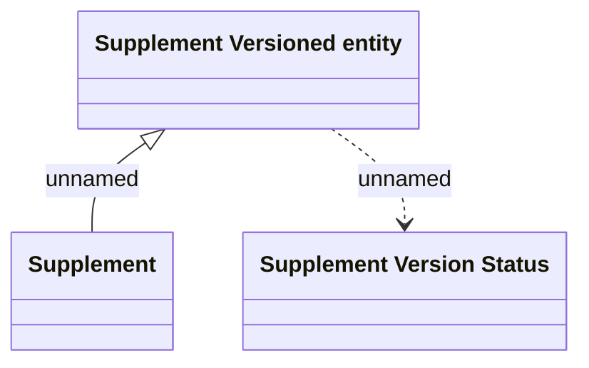

# Supplement Versioned entity

- **Diagram Type**: Logical
- **Package**: HomerSelect/BSL/Analysis Model/Contract Supplements/COMMON for Supplements/Supplement definition/Logical Data Model
- **Diagram ID**: 164449
- **Elements**: 3
- **Connectors**: 2

