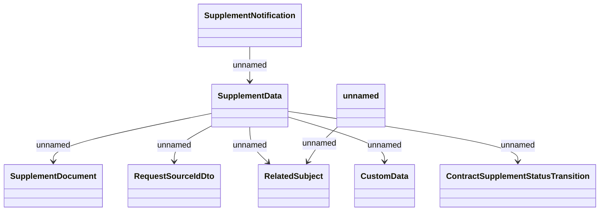

# Generated messages

- **Diagram Type**: Logical
- **Package**: HomerSelect/BSL/Analysis Model/Contract Supplements/Card Balance Transfer support/Interface Provided/Generated messages
- **Diagram ID**: 157636
- **Elements**: 8
- **Connectors**: 7

