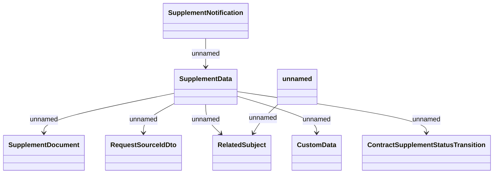

# Generated messages

```mermaid
classDiagram
    class SupplementDocument["SupplementDocument"]
    class SupplementNotification["SupplementNotification"]
    class SupplementData["SupplementData"]
    class CustomData["CustomData"]
    class RelatedSubject["RelatedSubject"]
    class ContractSupplementStatusTransition["ContractSupplementStatusTransition"]
    class RequestSourceIdDto["RequestSourceIdDto"]
    SupplementData --> SupplementDocument : unnamed
    SupplementData --> RequestSourceIdDto : unnamed
    SupplementData --> RelatedSubject : unnamed
    SupplementData --> CustomData : unnamed
    SupplementData --> ContractSupplementStatusTransition : unnamed
    SupplementNotification --> SupplementData : unnamed
    unnamed --> RelatedSubject : unnamed
```
