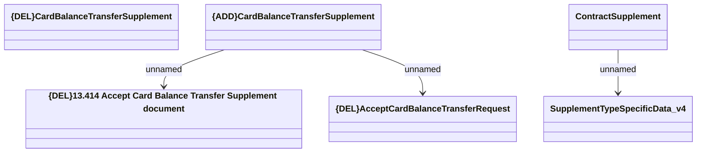

# Accept Card Balance Transfer Supplement documents - Web Service

```mermaid
classDiagram
    class DEL_AcceptCardBalanceTransferRequest["{DEL}AcceptCardBalanceTransferRequest"]
    class DEL_CardBalanceTransferSupplement["{DEL}CardBalanceTransferSupplement"]
    class DEL_13_414_Accept_Card_Balance_Transfer_Supplement_document["{DEL}13.414 Accept Card Balance Transfer Supplement document"]
    class ADD_CardBalanceTransferSupplement["{ADD}CardBalanceTransferSupplement"]
    class ContractSupplement["ContractSupplement"]
    class SupplementTypeSpecificData_v4["SupplementTypeSpecificData_v4"]
    ADD_CardBalanceTransferSupplement --> DEL_13_414_Accept_Card_Balance_Transfer_Supplement_document : unnamed
    ADD_CardBalanceTransferSupplement --> DEL_AcceptCardBalanceTransferRequest : unnamed
    ContractSupplement --> SupplementTypeSpecificData_v4 : unnamed
```
