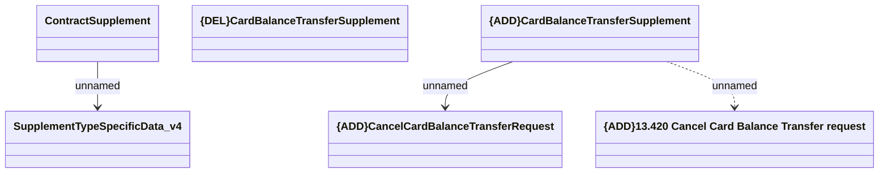

# Cancel Card Balance Transfer Supplement - Web Service

- **Diagram Type**: Logical
- **Package**: HomerSelect/BSL/Analysis Model/Contract Supplements/Card Balance Transfer support/Interface Provided/Web Services
- **Diagram ID**: 157617
- **Elements**: 6
- **Connectors**: 3

