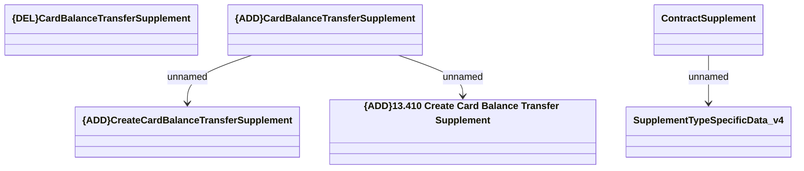

# Create Card Balance Transfer Supplement - Web Service

```mermaid
classDiagram
    class DEL_CardBalanceTransferSupplement["{DEL}CardBalanceTransferSupplement"]
    class ADD_13_410_Create_Card_Balance_Transfer_Supplement["{ADD}13.410 Create Card Balance Transfer Supplement"]
    class ADD_CreateCardBalanceTransferSupplement["{ADD}CreateCardBalanceTransferSupplement"]
    class ADD_CardBalanceTransferSupplement["{ADD}CardBalanceTransferSupplement"]
    class ContractSupplement["ContractSupplement"]
    class SupplementTypeSpecificData_v4["SupplementTypeSpecificData_v4"]
    ADD_CardBalanceTransferSupplement --> ADD_CreateCardBalanceTransferSupplement : unnamed
    ADD_CardBalanceTransferSupplement --> ADD_13_410_Create_Card_Balance_Transfer_Supplement : unnamed
    ContractSupplement --> SupplementTypeSpecificData_v4 : unnamed
```
