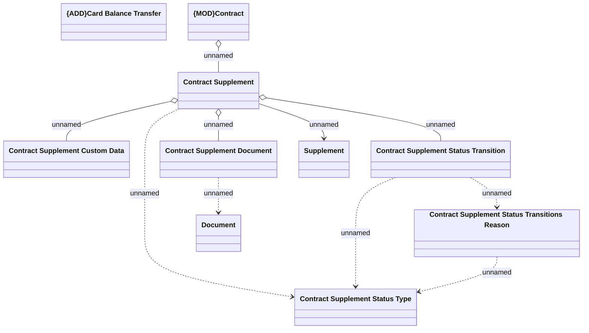

# Card Balance Transfer Supplement - Logical Domain Model

- **Diagram Type**: Logical
- **Package**: HomerSelect/BSL/Analysis Model/Contract Supplements/Card Balance Transfer support/Logical Domain Model
- **Diagram ID**: 157607
- **Elements**: 10
- **Connectors**: 10

