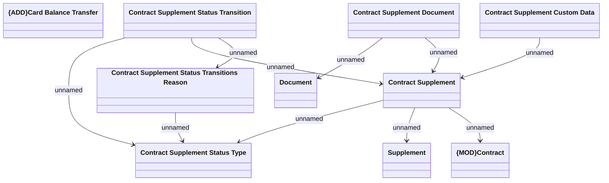

# Card Balance Transfer Supplement - Logical Domain Model

```mermaid
classDiagram
    class ADD_Card_Balance_Transfer["{ADD}Card Balance Transfer"]
    class Supplement["Supplement"]
    class Document["Document"]
    class MOD_Contract["{MOD}Contract"]
    class Contract_Supplement_Status_Transitions_Reason["Contract Supplement Status Transitions Reason"]
    class Contract_Supplement_Document["Contract Supplement Document"]
    class Contract_Supplement_Status_Transition["Contract Supplement Status Transition"]
    class Contract_Supplement["Contract Supplement"]
    class Contract_Supplement_Custom_Data["Contract Supplement Custom Data"]
    class Contract_Supplement_Status_Type["Contract Supplement Status Type"]
    Contract_Supplement_Document --> Document : unnamed
    Contract_Supplement --> Contract_Supplement_Status_Type : unnamed
    Contract_Supplement_Status_Transition --> Contract_Supplement_Status_Type : unnamed
    Contract_Supplement_Custom_Data --> Contract_Supplement : unnamed
    Contract_Supplement_Status_Transition --> Contract_Supplement : unnamed
    Contract_Supplement_Document --> Contract_Supplement : unnamed
    Contract_Supplement --> Supplement : unnamed
    Contract_Supplement_Status_Transition --> Contract_Supplement_Status_Transitions_Reason : unnamed
    Contract_Supplement_Status_Transitions_Reason --> Contract_Supplement_Status_Type : unnamed
    Contract_Supplement --> MOD_Contract : unnamed
```
