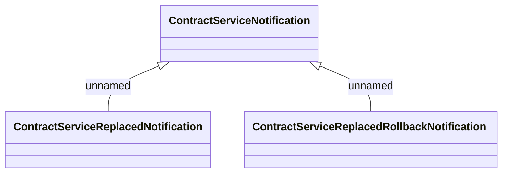

# ContractServiceNotification

- **Diagram Type**: Logical
- **Package**: HomerSelect/BSL/Analysis Model/Contract Supplements/Contract Service Support/Interface consumed/RMQ/COS
- **Diagram ID**: 164699
- **Elements**: 3
- **Connectors**: 2

