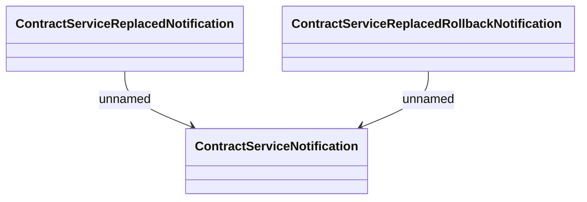

# ContractServiceNotification

```mermaid
classDiagram
    class ContractServiceNotification["ContractServiceNotification"]
    class ContractServiceReplacedRollbackNotification["ContractServiceReplacedRollbackNotification "]
    class ContractServiceReplacedNotification["ContractServiceReplacedNotification"]
    ContractServiceReplacedNotification --> ContractServiceNotification : unnamed
    ContractServiceReplacedRollbackNotification --> ContractServiceNotification : unnamed
```
