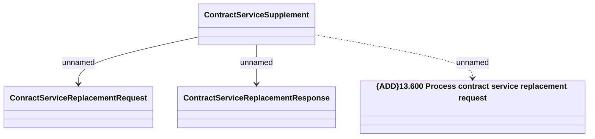

# Contract Service Replacement 

- **Diagram Type**: Logical
- **Package**: HomerSelect/BSL/Analysis Model/Contract Supplements/Contract Service Support/Interface provided/REST API
- **Diagram ID**: 164698
- **Elements**: 4
- **Connectors**: 3

