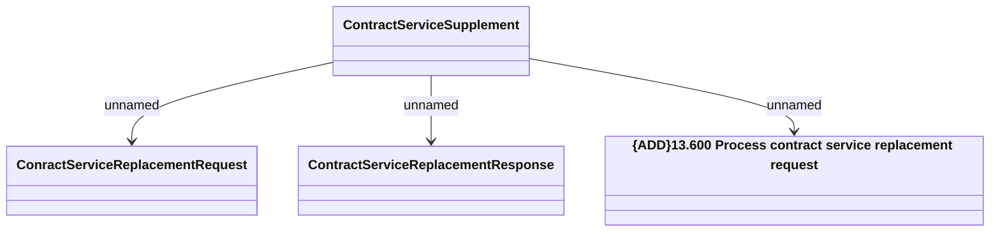

# Contract Service Replacement 

```mermaid
classDiagram
    class ADD_13_600_Process_contract_service_replacement_request["{ADD}13.600 Process contract service replacement request"]
    class ContractServiceReplacementResponse["ContractServiceReplacementResponse"]
    class ConractServiceReplacementRequest["ConractServiceReplacementRequest"]
    class ContractServiceSupplement["ContractServiceSupplement"]
    ContractServiceSupplement --> ConractServiceReplacementRequest : unnamed
    ContractServiceSupplement --> ContractServiceReplacementResponse : unnamed
    ContractServiceSupplement --> ADD_13_600_Process_contract_service_replacement_request : unnamed
```
