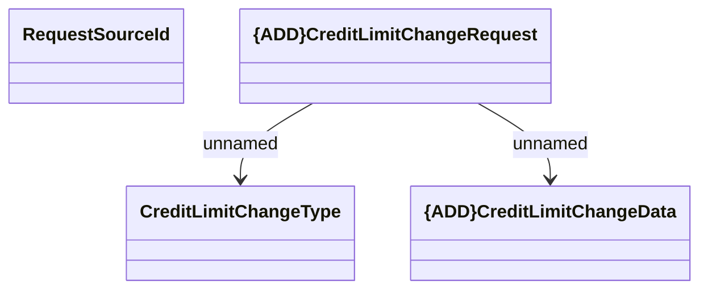

# Credit Limit Change Request - message structure

- **Diagram Type**: Logical
- **Package**: HomerSelect/BSL/Analysis Model/Contract Supplements/Credit limit change support/Interface/Consumed messages
- **Diagram ID**: 131018
- **Elements**: 4
- **Connectors**: 2

