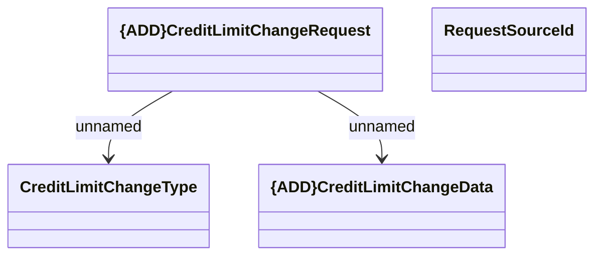

# Credit Limit Change Request - message structure

```mermaid
classDiagram
    class ADD_CreditLimitChangeData["{ADD}CreditLimitChangeData"]
    class CreditLimitChangeType["CreditLimitChangeType"]
    class ADD_CreditLimitChangeRequest["{ADD}CreditLimitChangeRequest"]
    class RequestSourceId["RequestSourceId"]
    ADD_CreditLimitChangeRequest --> CreditLimitChangeType : unnamed
    ADD_CreditLimitChangeRequest --> ADD_CreditLimitChangeData : unnamed
```
