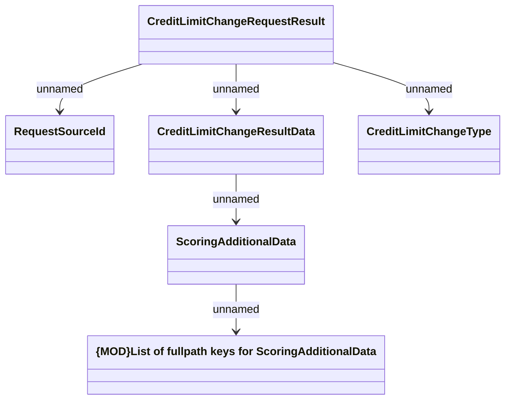

# Credit Limit Change Request - processing response message

```mermaid
classDiagram
    class MOD_List_of_fullpath_keys_for_ScoringAdditionalData["{MOD}List of fullpath keys for ScoringAdditionalData"]
    class ScoringAdditionalData["ScoringAdditionalData"]
    class RequestSourceId["RequestSourceId"]
    class CreditLimitChangeResultData["CreditLimitChangeResultData"]
    class CreditLimitChangeRequestResult["CreditLimitChangeRequestResult"]
    class CreditLimitChangeType["CreditLimitChangeType"]
    CreditLimitChangeRequestResult --> CreditLimitChangeResultData : unnamed
    CreditLimitChangeRequestResult --> CreditLimitChangeType : unnamed
    CreditLimitChangeRequestResult --> RequestSourceId : unnamed
    CreditLimitChangeResultData --> ScoringAdditionalData : unnamed
    ScoringAdditionalData --> MOD_List_of_fullpath_keys_for_ScoringAdditionalData : unnamed
```
