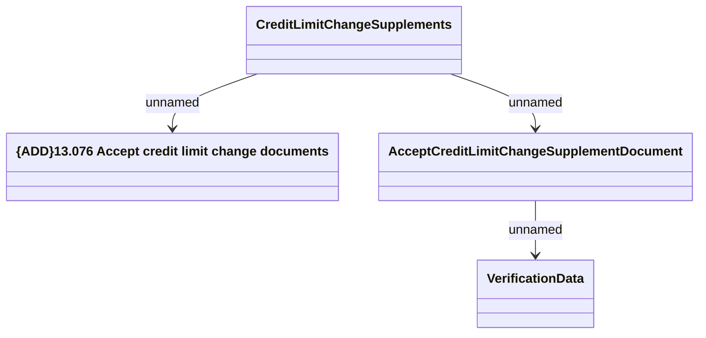

# CreditLimitChangeSupplements - Accept document

```mermaid
classDiagram
    class ADD_13_076_Accept_credit_limit_change_documents["{ADD}13.076 Accept credit limit change documents"]
    class VerificationData["VerificationData"]
    class AcceptCreditLimitChangeSupplementDocument["AcceptCreditLimitChangeSupplementDocument"]
    class CreditLimitChangeSupplements["CreditLimitChangeSupplements"]
    CreditLimitChangeSupplements --> AcceptCreditLimitChangeSupplementDocument : unnamed
    AcceptCreditLimitChangeSupplementDocument --> VerificationData : unnamed
    CreditLimitChangeSupplements --> ADD_13_076_Accept_credit_limit_change_documents : unnamed
```
