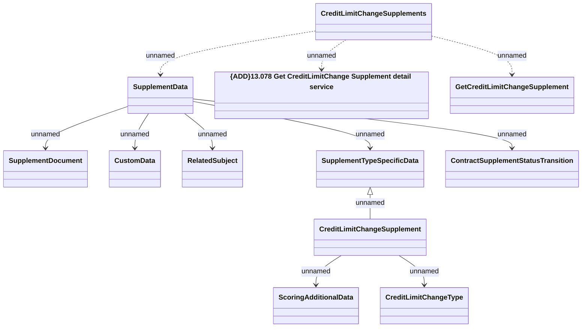

# CreditLimitChangeSupplements - Get supplement

- **Diagram Type**: Logical
- **Package**: HomerSelect/BSL/Analysis Model/Contract Supplements/Credit limit change support/Interface/Web Services/CreditLimitChangeSupplements/CreditLimitChangeSupplements_v1
- **Diagram ID**: 162781
- **Elements**: 12
- **Connectors**: 11

