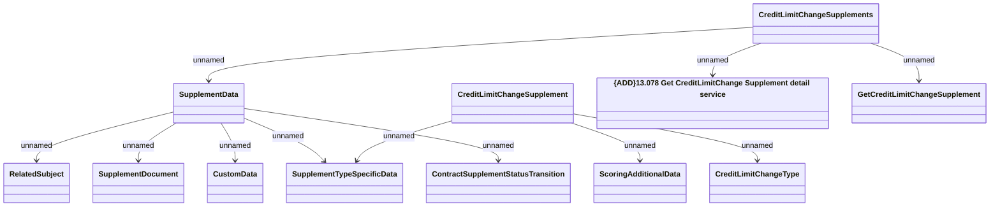

# CreditLimitChangeSupplements - Get supplement

```mermaid
classDiagram
    class ScoringAdditionalData["ScoringAdditionalData"]
    class SupplementDocument["SupplementDocument"]
    class CustomData["CustomData"]
    class RelatedSubject["RelatedSubject"]
    class SupplementTypeSpecificData["SupplementTypeSpecificData"]
    class CreditLimitChangeSupplement["CreditLimitChangeSupplement"]
    class SupplementData["SupplementData"]
    class CreditLimitChangeType["CreditLimitChangeType"]
    class ContractSupplementStatusTransition["ContractSupplementStatusTransition"]
    class ADD_13_078_Get_CreditLimitChange_Supplement_detail_service["{ADD}13.078 Get CreditLimitChange Supplement detail service"]
    class GetCreditLimitChangeSupplement["GetCreditLimitChangeSupplement"]
    class CreditLimitChangeSupplements["CreditLimitChangeSupplements"]
    CreditLimitChangeSupplements --> SupplementData : unnamed
    CreditLimitChangeSupplements --> ADD_13_078_Get_CreditLimitChange_Supplement_detail_service : unnamed
    CreditLimitChangeSupplements --> GetCreditLimitChangeSupplement : unnamed
    SupplementData --> RelatedSubject : unnamed
    CreditLimitChangeSupplement --> ScoringAdditionalData : unnamed
    CreditLimitChangeSupplement --> CreditLimitChangeType : unnamed
    SupplementData --> SupplementDocument : unnamed
    SupplementData --> CustomData : unnamed
    SupplementData --> SupplementTypeSpecificData : unnamed
    CreditLimitChangeSupplement --> SupplementTypeSpecificData : unnamed
    SupplementData --> ContractSupplementStatusTransition : unnamed
```
