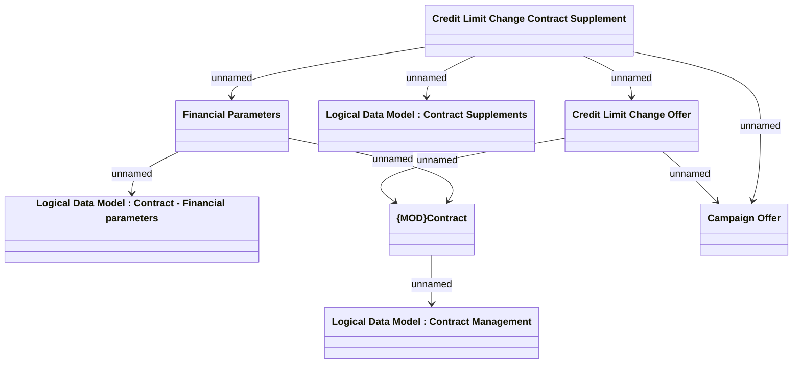

# Credit limit change offer

```mermaid
classDiagram
    class Logical_Data_Model_Contract_Financial_parameters["Logical Data Model : Contract - Financial parameters"]
    class Financial_Parameters["Financial Parameters"]
    class Logical_Data_Model_Contract_Supplements["Logical Data Model : Contract Supplements"]
    class Logical_Data_Model_Contract_Management["Logical Data Model : Contract Management"]
    class MOD_Contract["{MOD}Contract"]
    class Credit_Limit_Change_Offer["Credit Limit Change Offer"]
    class Campaign_Offer["Campaign Offer"]
    class Credit_Limit_Change_Contract_Supplement["Credit Limit Change Contract Supplement"]
    Credit_Limit_Change_Offer --> Campaign_Offer : unnamed
    Credit_Limit_Change_Offer --> MOD_Contract : unnamed
    Credit_Limit_Change_Contract_Supplement --> Campaign_Offer : unnamed
    Credit_Limit_Change_Contract_Supplement --> Financial_Parameters : unnamed
    Credit_Limit_Change_Contract_Supplement --> Credit_Limit_Change_Offer : unnamed
    Credit_Limit_Change_Contract_Supplement --> Logical_Data_Model_Contract_Supplements : unnamed
    Financial_Parameters --> MOD_Contract : unnamed
    Financial_Parameters --> Logical_Data_Model_Contract_Financial_parameters : unnamed
    MOD_Contract --> Logical_Data_Model_Contract_Management : unnamed
```
