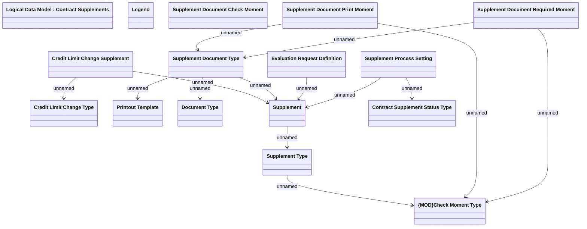

# Supplement definition for Credit limit change

```mermaid
classDiagram
    class Evaluation_Request_Definition["Evaluation Request Definition"]
    class Supplement_Process_Setting["Supplement Process Setting"]
    class Logical_Data_Model_Contract_Supplements["Logical Data Model : Contract Supplements"]
    class Credit_Limit_Change_Type["Credit Limit Change Type"]
    class Credit_Limit_Change_Supplement["Credit Limit Change Supplement"]
    class Legend["Legend"]
    class Supplement_Type["Supplement Type"]
    class Supplement_Document_Check_Moment["Supplement Document Check Moment"]
    class Supplement_Document_Required_Moment["Supplement Document Required Moment"]
    class Supplement_Document_Print_Moment["Supplement Document Print Moment"]
    class Printout_Template["Printout Template"]
    class Document_Type["Document Type"]
    class MOD_Check_Moment_Type["{MOD}Check Moment Type"]
    class Supplement_Document_Type["Supplement Document Type"]
    class Supplement["Supplement"]
    class Contract_Supplement_Status_Type["Contract Supplement Status Type"]
    Supplement_Process_Setting --> Supplement : unnamed
    Supplement_Process_Setting --> Contract_Supplement_Status_Type : unnamed
    Supplement_Document_Required_Moment --> Supplement_Document_Type : unnamed
    Supplement_Document_Required_Moment --> MOD_Check_Moment_Type : unnamed
    Evaluation_Request_Definition --> Supplement : unnamed
    Supplement_Document_Type --> Document_Type : unnamed
    Supplement_Document_Print_Moment --> Supplement_Document_Type : unnamed
    Supplement_Document_Type --> Printout_Template : unnamed
    Supplement_Document_Type --> Supplement : unnamed
    Supplement_Document_Print_Moment --> MOD_Check_Moment_Type : unnamed
    Credit_Limit_Change_Supplement --> Credit_Limit_Change_Type : unnamed
    Credit_Limit_Change_Supplement --> Supplement : unnamed
    Supplement --> Supplement_Type : unnamed
    Supplement_Type --> MOD_Check_Moment_Type : unnamed
```
