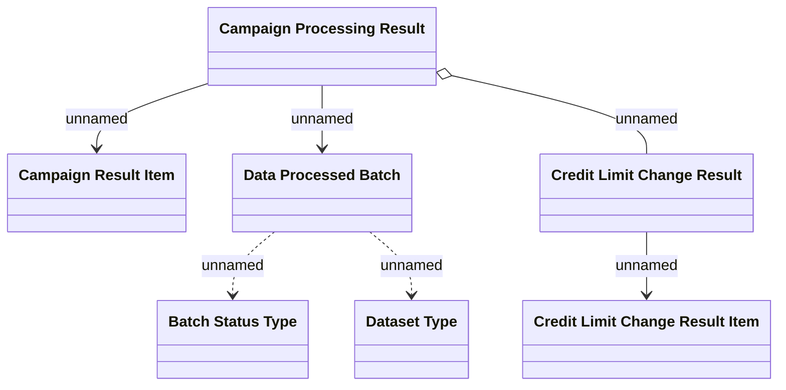

# Campaign processing result - LDM

- **Diagram Type**: Logical
- **Package**: HomerSelect/BSL/Analysis Model/Contract Supplements/Credit limit change support/Logical data model/Change credit limit request processing
- **Diagram ID**: 130554
- **Elements**: 7
- **Connectors**: 6

