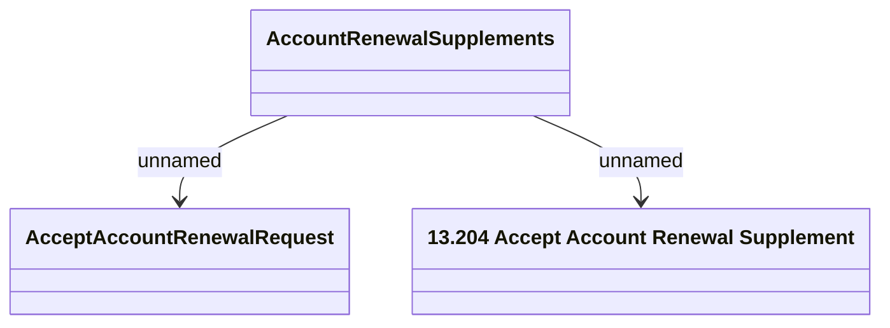

# Accept Account Renewal Supplement - Web Services

```mermaid
classDiagram
    class n_13_204_Accept_Account_Renewal_Supplement["13.204 Accept Account Renewal Supplement"]
    class AcceptAccountRenewalRequest["AcceptAccountRenewalRequest"]
    class AccountRenewalSupplements["AccountRenewalSupplements"]
    AccountRenewalSupplements --> AcceptAccountRenewalRequest : unnamed
    AccountRenewalSupplements --> n_13_204_Accept_Account_Renewal_Supplement : unnamed
```
